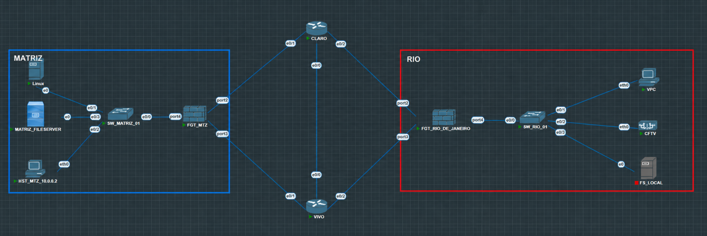
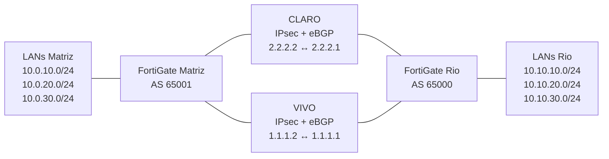

# LAB FortiGate — VPN IPsec, BGP Multipath/ECMP e SD-WAN

Neste LAB montei uma comunicação redundante entre a **Matriz (AS 65001)** e a unidade do **Rio de Janeiro (AS 65000)** utilizando dois caminhos de operadora, túneis VPN IPsec, eBGP, Multipath/ECMP e SD-WAN com Performance SLA.

O objetivo foi validar, na prática, como o ambiente se comporta em condição normal, durante degradação de link, em indisponibilidade de caminho e após a recuperação.

## Topologia do LAB



A Matriz e o Rio possuem três redes LAN cada. Os dois caminhos de operadora simulados, **CLARO** e **VIVO**, transportam túneis IPsec entre os FortiGates. Sobre esses túneis estabeleci duas sessões eBGP, permitindo dois caminhos para os prefixos remotos.

O BGP disponibiliza os caminhos e o SD-WAN avalia a qualidade dos membros por meio do Performance SLA.

## O que implementei

- VPN IPsec route-based entre Matriz e Rio por dois caminhos;
- duas adjacências eBGP entre os FortiGates;
- anúncio das LANs das duas unidades via BGP;
- BGP Multipath / ECMP;
- SD-WAN utilizando os túneis IPsec como membros;
- Performance SLA entre as unidades;
- seleção de caminho com base em perda de pacotes;
- testes de degradação controlada;
- teste de indisponibilidade de caminho;
- validação de failover e recuperação automática;
- coleta de evidências reais do ambiente.

## Arquitetura lógica



O fluxo técnico do LAB ficou:

```text
Underlay
   ↓
VPN IPsec
   ↓
eBGP
   ↓
Multipath / ECMP
   ↓
SD-WAN
   ↓
Performance SLA
```

## Resultados do LAB

| Cenário | Resultado observado |
| --- | --- |
| BGP em condição normal | Dois neighbors `Established` em cada FortiGate e três prefixos recebidos por neighbor |
| Multipath / ECMP | Dois next-hops disponíveis por prefixo remoto |
| Degradação VIVO — Matriz → Rio | 22% de perda induzida, mantendo as sessões BGP estabelecidas |
| Degradação CLARO — Rio → Matriz | 17% de perda induzida, mantendo as sessões BGP estabelecidas |
| Indisponibilidade de caminho | O SLA marcou o caminho indisponível e a comunicação continuou pelo caminho remanescente |
| Convergência | Duas perdas ICMP consecutivas foram observadas durante o teste |
| Recuperação | Retorno automático do SLA, BGP e ECMP ao estado saudável |

As perdas de 22% e 17% foram **induzidas intencionalmente no LAB**, em testes separados, para simular degradação de WAN e observar a reação do SD-WAN. Não representam falhas reais das operadoras.

Durante o teste da VIVO, registrei 22% de perda, porém a captura específica dessa medição não foi preservada. Por isso, esse valor está documentado como resultado observado no LAB, mas não como evidência visual disponível no repositório.

Também não utilizo as duas perdas ICMP para afirmar um tempo exato de failover, pois o intervalo do ping não foi registrado.

## Evidências em destaque

### BGP Multipath / ECMP


Na Matriz, a rede `10.10.10.0/24` foi aprendida com dois next-hops: um pelo túnel VIVO e outro pelo túnel CLARO.

### SD-WAN e degradação controlada


Durante o teste Rio → Matriz, induzi perda de **17% na CLARO**, enquanto a VIVO permaneceu com 0%. As sessões BGP continuaram estabelecidas.

Essa evidência demonstra a degradação medida e a manutenção das adjacências BGP. A captura, isoladamente, não identifica qual túnel encaminhou cada sessão.

### Indisponibilidade de caminho


No teste de indisponibilidade, o Performance SLA marcou a VIVO como indisponível enquanto a CLARO permaneceu saudável.

### Convergência


Durante a convergência foram observados timeouts nas sequências 237 e 238, com as respostas sendo retomadas a partir da sequência 239.

### Recuperação


Após remover a condição de falha, os membros retornaram ao estado saudável e o ambiente voltou à condição normal.

A galeria completa possui dez evidências reais do LAB, com a descrição do que cada captura comprova e também de suas limitações:

➡️ [Ver todas as evidências](images/README.md)

## BGP e SD-WAN

Uma parte importante deste LAB foi separar corretamente o papel de cada tecnologia.

O **BGP Multipath** mantém mais de um caminho disponível para os prefixos remotos. Já o **SD-WAN** avalia os membros e orienta o encaminhamento do tráfego correspondente à regra.

Em outras palavras:

> **O BGP disponibiliza os caminhos; o SD-WAN seleciona qual utilizar.**

Nos testes de degradação, as sessões BGP permaneceram estabelecidas mesmo quando havia perda significativa no caminho. Isso reforça que uma sessão BGP estabelecida, sozinha, não representa a qualidade daquele caminho para o tráfego.

## Configurações do LAB

Publiquei somente os trechos necessários para demonstrar o funcionamento deste cenário:

- [FortiGate Matriz](configs/fortigate-matriz.conf)
- [FortiGate Rio](configs/fortigate-rio.conf)
- [Explicação dos recortes de configuração](configs/README.md)

Os arquivos incluem os trechos relacionados a:

- VPN IPsec;
- interfaces dos túneis;
- SD-WAN;
- Performance SLA;
- BGP.

As PSKs e demais informações sensíveis foram removidas. Esses arquivos são **recortes para estudo e demonstração**, e não backups completos para restauração.

## Documentação técnica

Para não transformar o README principal em uma documentação extensa, organizei os detalhes do LAB em páginas separadas:

- [Topologia e papel de cada camada](docs/topology.md)
- [Endereçamento](docs/addressing.md)
- [BGP Multipath e ECMP](docs/bgp.md)
- [SD-WAN e Performance SLA](docs/sdwan.md)
- [Testes e validações](docs/testing.md)
- [Configurações utilizadas](configs/README.md)
- [Galeria completa de evidências](images/README.md)

## Como reproduzir o cenário

Para reproduzir a lógica do LAB:

1. preparar o underlay entre os endpoints;
2. validar a conectividade IP entre as pontas;
3. estabelecer os dois túneis IPsec;
4. endereçar as interfaces dos túneis;
5. estabelecer os peers eBGP;
6. anunciar as LANs das duas unidades;
7. habilitar o Multipath / ECMP;
8. adicionar os túneis ao SD-WAN;
9. configurar o Performance SLA;
10. validar baseline antes de iniciar qualquer degradação;
11. realizar os testes de degradação, indisponibilidade e recuperação em ambiente isolado.

Versão utilizada no LAB:

```text
FortiOS 7.2.8 build 1639
```

## Escopo e limitações

Este repositório representa um **laboratório controlado**.

Não publiquei:

- credenciais;
- PSKs;
- exportações completas dos FortiGates;
- endereços de gerenciamento;
- dados de produção.

Os endereços de overlay `1.1.1.x` e `2.2.2.x` reproduzem o LAB, mas pertencem a espaço público. Eles devem permanecer isolados e não devem ser anunciados para redes externas.

As políticas de firewall necessárias para permitir a comunicação entre as LANs não fazem parte dos recortes publicados e precisam ser consideradas em uma reprodução do cenário.

## Próximas evoluções

Este LAB cobre a comunicação redundante **Matriz ↔ Rio**.

As próximas etapas planejadas para o ambiente são:

- estabelecer BGP entre **Matriz e Minas**, utilizando FortiGate na Matriz e pfSense em Minas;
- validar a troca de rotas em um cenário multi-vendor;
- posteriormente permitir que o tráfego de **Minas alcance o Rio através da Matriz**, utilizando a Matriz como ponto de trânsito.

---

**Ronan Braga**

LAB desenvolvido para estudo prático e portfólio técnico nas áreas de **Network Security, Fortinet, VPN IPsec, BGP, SD-WAN, ECMP e troubleshooting de redes**.
