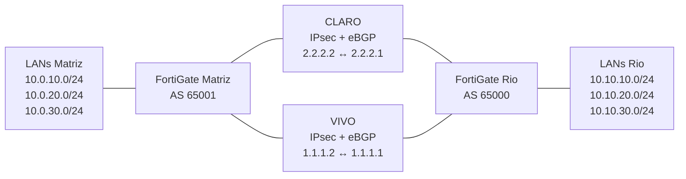

# LAB FortiGate — VPN IPsec, BGP Multipath/ECMP e SD-WAN

Laboratório de conectividade redundante entre **Matriz (AS 65001)** e **Rio de Janeiro (AS 65000)**, com dois caminhos de operadora, VPN IPsec, roteamento dinâmico e seleção de caminho por qualidade.

## Objetivo

Manter a comunicação entre as LANs das duas unidades diante de degradação ou indisponibilidade de um caminho. O IPsec fornece os túneis; o eBGP anuncia as redes; o multipath permite instalar caminhos equivalentes; o SD-WAN usa medições de perda de pacotes para orientar o encaminhamento.

## Topologia lógica

## Resultados registrados no LAB

| Cenário | Resultado |
| --- | --- |
| BGP em condição normal | Dois neighbors Established em cada FortiGate; três prefixos recebidos por neighbor |
| ECMP | Dois next-hops por prefixo remoto |
| Degradação CLARO: Matriz → Rio | 22% de perda, mantendo BGP estabelecido |
| Degradação CLARO: Rio → Matriz | 17% de perda, mantendo BGP estabelecido |
| Indisponibilidade de caminho | Duas perdas ICMP consecutivas durante a convergência |
| Recuperação | Automática, com retorno dos caminhos ao estado saudável |

Esses resultados foram confirmados pelo autor no LAB e registrados na conversa de desenvolvimento. Não representam novos testes executados a partir deste repositório. As capturas originais não estão incluídas; veja [evidências e limitações](docs/testing.md). Duas perdas ICMP não permitem deduzir um tempo exato de failover.

## Documentação

- [Topologia e papel de cada camada](docs/topology.md)
- [Endereçamento completo](docs/addressing.md)
- [BGP e ECMP](docs/bgp.md)
- [SD-WAN e Performance SLA](docs/sdwan.md)
- [Testes, resultados e roteiro de reprodução](docs/testing.md)
- [Troubleshooting](docs/troubleshooting.md)
- [Configurações parciais e pendências](configs/README.md)
- [Organização das imagens](images/README.md)

## Como estudar ou reproduzir

1. Consulte a topologia e o endereçamento.
2. Complete os TODOs de interfaces, versão do FortiOS, IPsec, políticas e infraestrutura em `configs/`.
3. Valide underlay e túneis antes de habilitar o roteamento entre as LANs.
4. Confirme BGP e ECMP; em seguida, valide os membros e medições do SD-WAN.
5. Execute o roteiro de testes em ambiente isolado, registrando baseline, degradação, falha e recuperação.

**As configurações são exemplos parciais, não backups nem arquivos prontos para importação.** A versão/build do FortiOS não foi confirmada. Os endereços de overlay foram preservados conforme o LAB; pertencem a espaço público e devem permanecer isolados de redes externas.

## Escopo

Inclui os dados confirmados do LAB. Não inclui credenciais, PSKs, exportações completas dos equipamentos ou endereços de gerenciamento. Máscaras dos túneis, propostas IPsec, políticas, interfaces físicas, VLAN IDs e parâmetros não confirmados estão marcados como TODO.

A documentação técnica da Fortinet é referenciada nas páginas de BGP e SD-WAN; as versões citadas servem como referência e não identificam a versão utilizada neste LAB.
