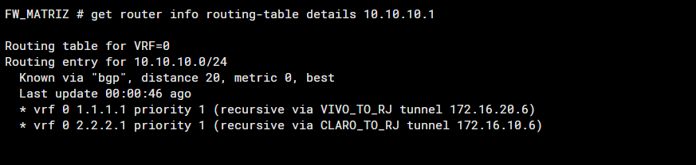

# BGP Multipath e ECMP

## Adjacências

São duas sessões eBGP por FortiGate, uma por túnel.

| FortiGate | AS local | Neighbor VIVO | Neighbor CLARO | AS remoto |
| --- | --- | --- | --- | --- |
| Matriz | 65001 | 1.1.1.1 | 2.2.2.1 | 65000 |
| Rio | 65000 | 1.1.1.2 | 2.2.2.2 | 65001 |

A Matriz anuncia 10.0.10.0/24, 10.0.20.0/24 e 10.0.30.0/24. O Rio anuncia 10.10.10.0/24, 10.10.20.0/24 e 10.10.30.0/24.Orouter-id utilizado foi 1.1.1.9 na Matriz e 1.1.1.10 no Rio.

## Multipath

Neste LAB, o BGP Multipath mantém dois caminhos disponíveis para as redes remotas: um pela VPN VIVO e outro pela VPN CLARO, conforme demonstrado na tabela de roteamento abaixo.

Para o tráfego que corresponde à regra SD-WAN, a estratégia **Best Quality** escolhe entre esses caminhos com base na perda de pacotes medida pelo **Performance SLA**. Assim, os dois next-hops podem continuar instalados enquanto o SD-WAN prefere o túnel com melhor qualidade.

**O BGP disponibiliza os caminhos; o SD-WAN seleciona qual utilizar.**

O `ebgp-multipath` está habilitado nos dois FortiGates. Referência técnica: [Equal cost multi-path](https://docs.fortinet.com/document/fortigate/7.4.5/administration-guide/25967).

| Local da consulta | Prefixos remotos | Next-hops confirmados |
| --- | --- | --- |
| Matriz | As três LANs do Rio | 1.1.1.1 e 2.2.2.1 |
| Rio | As três LANs da Matriz | 1.1.1.2 e 2.2.2.2 |



Captura na Matriz: a consulta a `10.10.10.1` mostra a rota `10.10.10.0/24` com os next-hops `1.1.1.1` via `VIVO_TO_RJ` e `2.2.2.1` via `CLARO_TO_RJ`.

A presença dos dois next-hops na tabela não significa que o tráfego será dividido em 50/50: para o tráfego correspondente à regra, a escolha do túnel segue a estratégia SD-WAN descrita acima.

## Validação

Comandos de consulta usados no roteiro; conferir disponibilidade na versão instalada:

```text
get router info bgp summary
get router info routing-table bgp
get router info routing-table details 10.10.10.0
```

No Rio, substituir o prefixo da última consulta por 10.0.10.0. Repetir para as demais LANs.

Critérios: dois peers estabelecidos, três prefixos recebidos por peer e dois next-hops instalados por prefixo remoto. Na saída de resumo, a coluna final pode mostrar a quantidade de prefixos quando a sessão está estabelecida.

## Relação com SD-WAN

Nos testes de degradação, o BGP permaneceu estabelecido mesmo com perdas de 22% e 17% forçadas para teste de failover. A disponibilidade da sessão BGP, isoladamente, não representa a qualidade do caminho para a aplicação. Não é necessário afirmar que a rota BGP foi removida para explicar uma preferência SD-WAN por outro caminho.

Recortes de VPN, interfaces de túnel e SD-WAN/SLA (sem o bloco de configuração BGP): [Matriz](../configs/fortigate-matriz.conf) e [Rio](../configs/fortigate-rio.conf).
