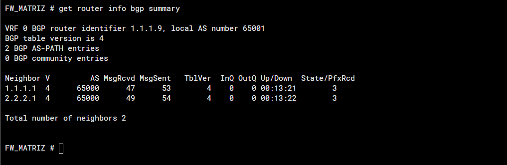
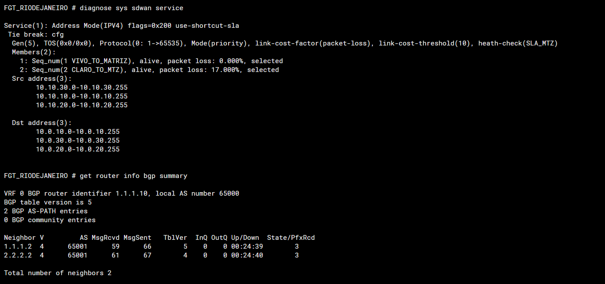
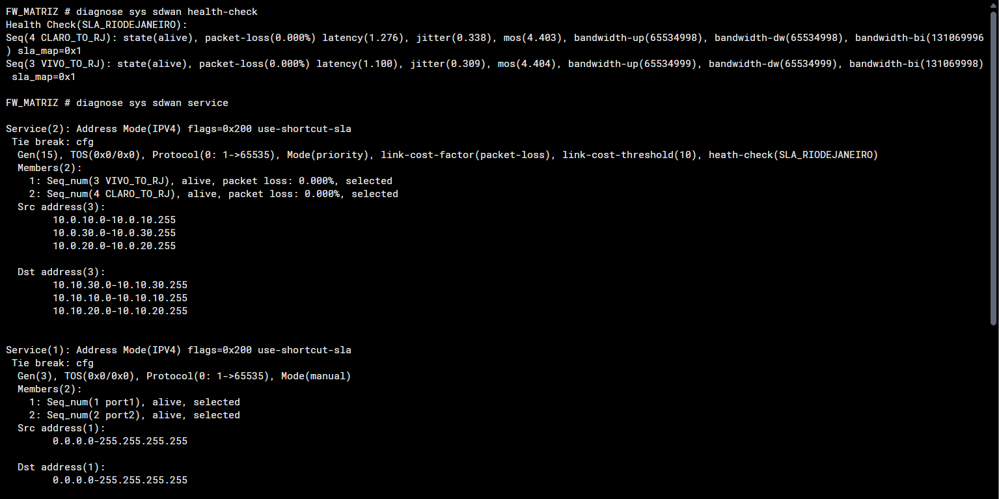

# SD-WAN e Performance SLA

## Estratégia confirmada

O LAB utiliza **Best Quality**, com **Packet Loss** como critério, e Performance SLA até a unidade remota.

Best Quality compara a métrica escolhida entre os caminhos. A avaliação de metas SLA e a comparação de qualidade não são conceitos intercambiáveis: ultrapassar 8% não comprova, isoladamente, que o membro foi excluído. Referências: [Best quality strategy](https://docs.fortinet.com/document/fortigate/7.4.5/administration-guide/022371/best-quality-strategy) e [Fields for configuring WAN intelligence](https://docs.fortinet.com/document/fortigate/7.4.5/administration-guide/582798/fields-for-configuring-wan-intelligence).

## Parâmetros observados

| Parâmetro | Valor |
| --- | --- |
| SLA Matriz → Rio | 10.10.10.1 |
| SLA Rio → Matriz | 10.0.10.1 |
| Latency threshold | 40 ms |
| Jitter threshold | 40 ms |
| Packet loss threshold | 8% |
| Check interval | 500 ms |
| Failures before inactive | 5 |
| Restore | 5 checks |

Não se deduz um tempo exato de convergência pela multiplicação de intervalo e contagem: temporizadores, sondas, sessões e o instante da falha afetam o resultado observado.

## Interpretação dos testes

A degradação foi **induzida de propósito em testes separados**: primeiro, 22% de perda na **VIVO**; depois, 17% na **CLARO**. O objetivo foi simular perda nos links e verificar a atuação do SD-WAN com Performance SLA. Não foram falhas espontâneas nem duas medições do mesmo teste no mesmo link.

### VIVO: perda induzida de 22% — Matriz → Rio

O autor relata 22% de perda induzida na VIVO, mantendo o BGP estabelecido. A captura abaixo registra os dois neighbors BGP com três prefixos cada; ela não mostra a medição de perda nem o caminho utilizado pelas sessões.

*Obs.: No momento do teste, a evidência dos 22% acabou se perdendo... rsrs. O resultado fica registrado pelo relato do autor, mas sem o print dessa medição.*



### CLARO: perda induzida de 17% — Rio → Matriz

Em outro teste, foi induzida perda na CLARO. A captura mostra **CLARO_TO_MTZ com 17%**, **VIVO_TO_MATRIZ com 0%** e os dois neighbors BGP recebendo três prefixos cada.



Ambos os membros aparecem como `selected`. Essa saída comprova a perda medida com BGP mantido, mas não identifica, sozinha, o túnel usado por cada sessão.

### Recuperação

Após retirar a degradação, houve retorno automático ao estado saudável, conforme registrado no LAB. A captura mostra os dois membros com 0% de perda e `alive/selected`.



A documentação da Fortinet mostra que ambos os membros podem aparecer como `selected` em Best Quality. Para comprovar o caminho efetivo de um fluxo, correlacione ordem/prioridade do serviço, sessão e captura de tráfego. O status isolado não é prova suficiente.

## Consultas

```text
diagnose sys sdwan health-check
diagnose sys sdwan service
```

Algumas versões usam variantes como `service4`; confirmar pela ajuda da CLI. Registrar métricas por membro, ordem de preferência, regra correspondente ao fluxo e estado dos neighbors.

## Evidências visuais

- [Rio: perda induzida de 17% com BGP ativo](../images/tests/rio-claro-perda-17-bgp.png).
- [Rio: baseline e serviço SD-WAN](../images/sdwan/rio-baseline-ecmp-sla.png).
- [Matriz: retorno do SLA ao estado saudável](../images/sdwan/matriz-recuperacao-sla.png).

As capturas confirmam link-cost-threshold(10), serviço 1 no Rio e serviço 2 na Matriz para o tráfego entre LANs. No Rio, VIVO_TO_MATRIZ usa membro 1 e CLARO_TO_MTZ, membro 2; na Matriz, VIVO_TO_RJ usa membro 3 e CLARO_TO_RJ, membro 4. Esses valores descrevem os prints, sem substituir um backup completo.

## Configuração extraída dos backups

[Matriz](../configs/fortigate-matriz.conf): zona SDWAN_RIO, regra SDWAN_RIODEJANEIRO, SLA_RIODEJANEIRO com origem 10.0.10.1 e destino 10.10.10.1.

[Rio](../configs/fortigate-rio.conf): zona SDWAN_MTZ, regra SDWAN_MATRIZ, SLA_MTZ com origem 10.10.10.1 e destino 10.0.10.1.

Os dois SLAs contêm `update-static-route disable` e thresholds de 40 ms, 40 ms e 8%. Protocolo, intervalo, failtime, recoverytime e link-cost-threshold não aparecem explicitamente nos respectivos blocos do backup; os valores observados nos testes não foram acrescentados ao export. Grupos de endereços e políticas são dependências externas aos recortes.
