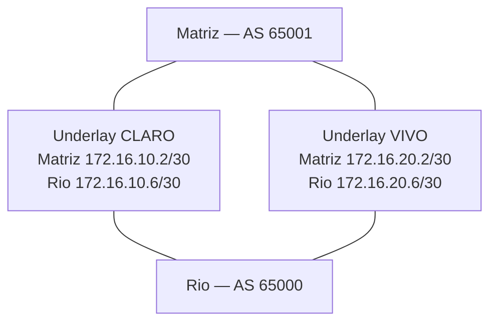

# Topologia

## Unidades e caminhos

A Matriz e o Rio possuem um FortiGate e três redes LAN cada. Dois caminhos independentes no desenho lógico, CLARO e VIVO, transportam túneis IPsec entre as unidades. A independência física real das operadoras não foi medida.

| Camada | Função no LAB |
| --- | --- |
| Underlay | Conectividade IP entre endpoints pelos roteadores CLARO e VIVO |
| Overlay IPsec | Transporte entre unidades por dois túneis |
| eBGP | Troca dos três prefixos LAN de cada unidade |
| ECMP | Instalação de dois next-hops equivalentes por prefixo |
| SD-WAN | Seleção de caminho baseada na qualidade medida |
| Performance SLA | Medição até a LAN remota |

O diagrama é lógico: os endpoints de cada operadora estão em sub-redes /30 diferentes e precisam de roteamento pelo underlay. Não são enlaces diretos de uma mesma sub-rede.

## Sequência de dependências

1. Os FortiGates alcançam seus gateways locais.
2. O underlay encaminha até o endpoint remoto da operadora correspondente.
3. Os túneis IPsec ficam operacionais.
4. Os neighbors eBGP estabelecem adjacência pelos endereços de túnel.
5. As redes remotas entram na tabela de rotas com ECMP.
6. As regras SD-WAN avaliam as métricas dos membros para o tráfego correspondente.

## Pendências de reprodução

TODO: versão/build do FortiOS, plataforma de virtualização, nomes das interfaces físicas, mapeamento de portas, equipamentos e software dos roteadores/switches, IDs de VLAN, políticas de firewall, NAT, parâmetros IPsec e mecanismo de indução de perda.

O [endereçamento](addressing.md) registra apenas valores confirmados; os [exemplos](../configs/README.md) não preenchem essas lacunas por suposição.
