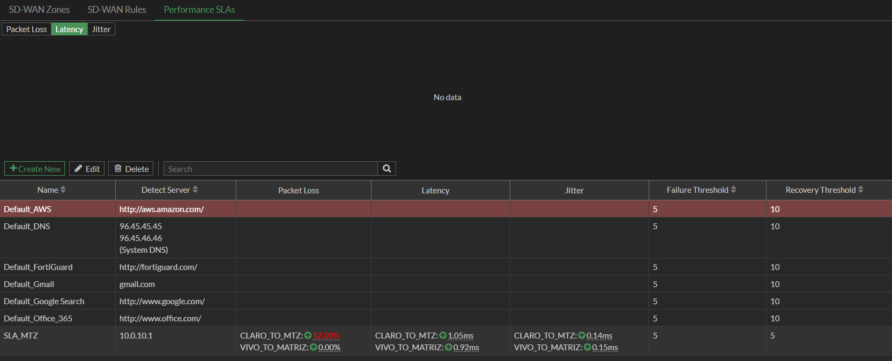
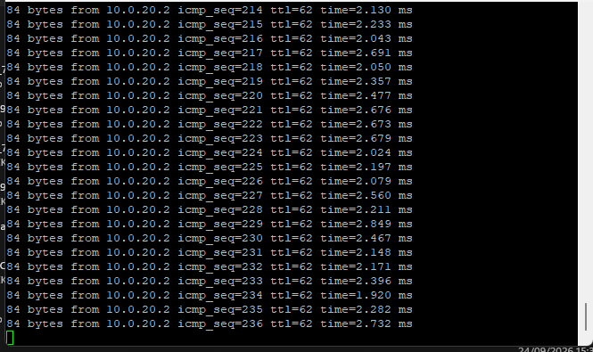
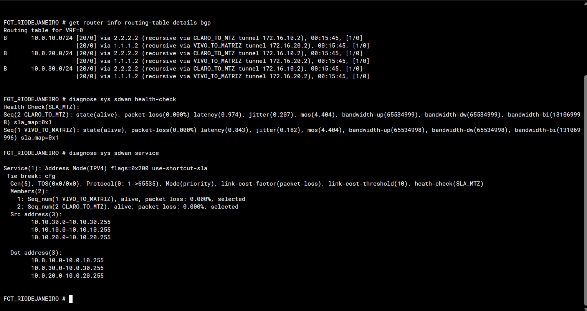
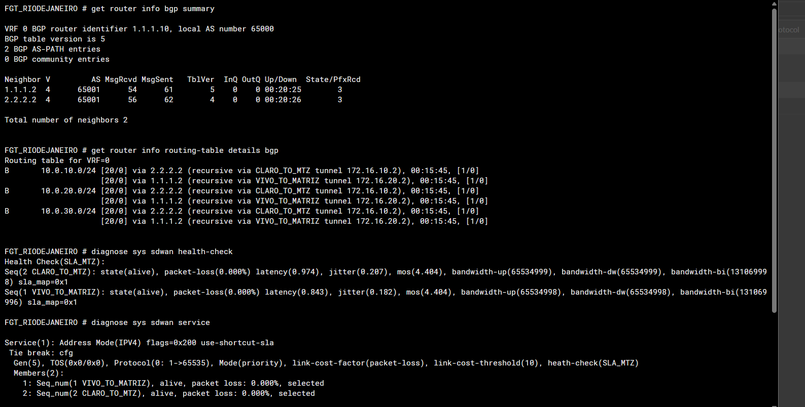
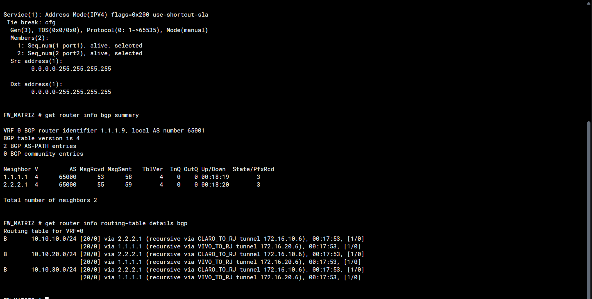
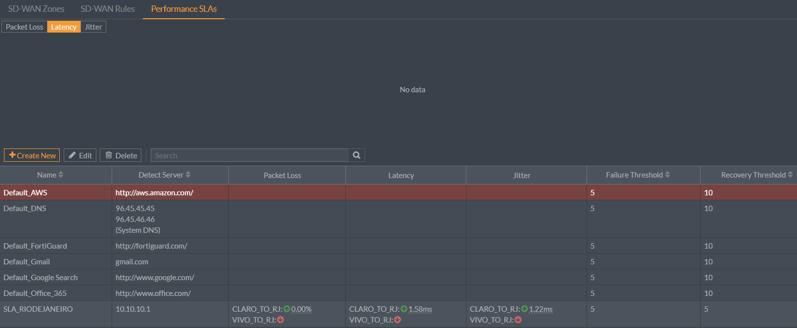
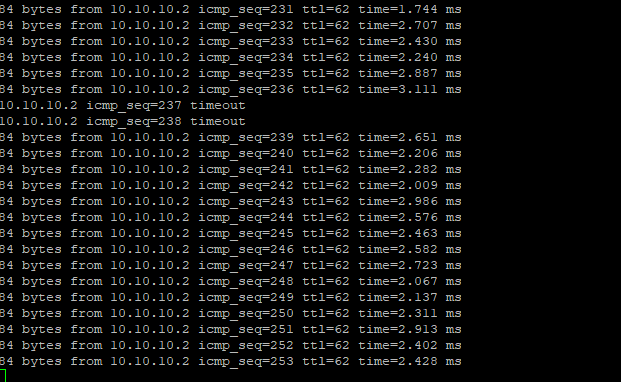

# Evidências reais do LAB

Dez prints enviados pelo autor na conversa original, revisados individualmente. Foram feitos apenas recortes locais sem redimensionamento; textos, números e estados mantidos não foram recriados. Barras do navegador, dados de gerenciamento e controles de usuário foram removidos; as imagens exportadas não contêm campos de metadados. Os originais não sanitizados não fazem parte do repositório.

A perda foi **induzida intencionalmente em ambiente controlado** para testar a reação do SD-WAN ao Performance SLA. As imagens retratam momentos distintos. [Metodologia e limites](../docs/testing.md).

## 1. Rio → Matriz: perda induzida de 17%

CLARO com 17% de perda e VIVO com 0%; ambos alive/selected. Os dois neighbors recebem três prefixos. A captura não identifica o caminho de cada sessão.

## 2. Rio: medição intermediária de 12%

SLA_MTZ registra CLARO com 12% e VIVO com 0%, antes da captura final de 17%. Failure/Recovery Threshold iguais a 5 para esse SLA.

## 3. Rio → Matriz: ping contínuo

Respostas do destino 10.0.20.2, sequências 214 a 236, sem timeout no trecho visível. O vínculo com o teste inverso vem da conversa original; o print não mostra a origem nem prova o túnel utilizado.

## 4. Rio: baseline de ECMP e SLA

As três LANs da Matriz têm dois next-hops. CLARO e VIVO com 0% de perda; serviço com packet-loss e link-cost-threshold(10).

## 5. Rio: neighbors e ECMP

Dois peers do AS 65001, três prefixos por peer e dois next-hops por LAN da Matriz; SLA saudável.

## 6. Matriz: recuperação do SLA

CLARO e VIVO alive, com 0% de perda e selected no serviço entre LANs. O contexto de recuperação é registrado na conversa; a imagem isolada mostra o estado saudável.

## 7. Matriz: recuperação de BGP e ECMP

Dois peers do AS 65000 com três prefixos por peer e dois next-hops por LAN do Rio.

## 8. Matriz: VIVO indisponível no SLA

SLA_RIODEJANEIRO mostra VIVO indisponível e CLARO com 0% de perda. Não demonstra, isoladamente, falha física da operadora nem queda de BGP.

## 9. Convergência: duas perdas ICMP

O destino 10.10.10.2 responde na sequência 236, apresenta timeout em 237 e 238 e volta a responder em 239. O intervalo do ping não está documentado.

## 10. Matriz: BGP durante a degradação

Dois neighbors com três prefixos recebidos. O histórico associa a captura ao teste com perda induzida de 22%; o percentual não aparece nesta imagem.

## Cobertura

Este conjunto cobre BGP, ECMP, SLA, degradação, indisponibilidade e recuperação. Não inclui captura de topologia, parâmetros IPsec ou tela com a medição de 22%. A topologia lógica continua disponível em Mermaid no README. Os recortes não corrigem truncamentos que já existiam nas capturas originais.
